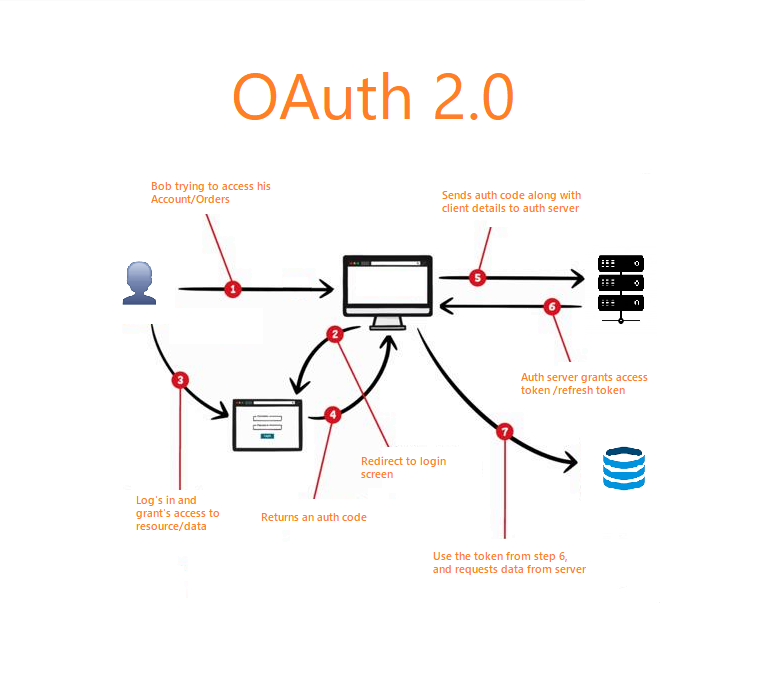

# 42AuthBot 🤖

42AuthBot is a **proof of concept (PoC)** designed to authenticate Discord users via the 42 API. Developed in JavaScript, it leverages the `discord.js` library and `Axios` for basic HTTP requests, facilitating interactions with the 42 API. 🌐

## Overview 📄

This PoC is not yet ready for production environments but serves as an excellent starting point for those interested in creating a similar authentication bot. 🚀

### Key Points 🔑

- **Token Refresh**: The bot currently does not handle token refreshes. Users might need to manually reauthenticate to refresh their tokens. This functionality may be considered for future updates. 🔁
- **Rate Limiting**: There is no built-in protection against rate limiting. Implementing rate limiting measures is recommended for use in large servers to prevent potential bans from the 42 API. ⚠️

### OAuth2 Flow 🔄

The bot simplifies the OAuth2 flow by skipping the refresh token step, proceeding directly to the last authentication step after the initial login.

 📊

### Components 🛠️

The bot consists of two main components:

- **Discord Bot**: Runs on Discord servers, interacting with users. 💬
- **API Server**: A simple HTTP server using `express.js` to manage the OAuth2 flow and communicate with the 42 API. 🌍

### Functionality 🌟

- **Login Command**: Sends a message with a link to the API's callback route, adding the state to the user's data. 🔗
- **Nickname Update**: Upon successful authentication, the bot can update the user's nickname to match their 42 login. This can be disabled by setting `UPDATE_NICKNAME_ON_LOGIN=false` in the `.env` file. 🏷️
- **Token Management**: For subsequent commands requiring authentication, the bot retrieves the user's token from the database using their state ID. 🔑

### Session Management 📦

Logging out or re-authenticating deletes old states from the database to maintain a clean state collection. 🗑️

### Code Simplicity 📚

The codebase intentionally utilizes basic examples from both `discord.js` and `express.js` to ensure ease of understanding and accessibility for beginners. Before diving into this project, it's recommended to familiarize yourself with the [discord.js documentation](https://discord.js.org/#/docs) and [express.js documentation](https://expressjs.com/). 📘📗

### Database Interaction 💾

A simple wrapper, `db.js`, is used for database interactions, primarily designed for MongoDB. This can be customized for different database solutions. 🛢️

## Getting Started 🚀

### Prerequisites 📋
- Docker 🐳 or node 20.15.1 installed on your system and a mongodb instance
- A Discord bot token (obtained from the [Discord Developer Portal](https://discord.com/developers/applications))
- A 42 API client ID and secret (obtained from the [42 API](https://profile.intra.42.fr/oauth/applications))

When creating your discord bot, ensure you have the following permissions enabled:
- `Manage Nicknames`

### Using Docker 🐳 (preferred)

1. Ensure you have Docker installed on your system.
2. Copy the `.env.example` file to `.env` and fill in the necessary details.
3. Build the Docker image using the command (using --build to ensure the latest code is used):
```bash
docker compose up --build -d
```
4. Check the logs to ensure the bot is running correctly:
```bash
docker logs 42authbot-node
```

### Using Node.js

If using Node.js, you'll need to have a MongoDB instance running somewhere accessible to the bot.
You may want to consider using the docker method instead if you're not familiar with MongoDB, it will do everything for you.

1. Ensure you have Node.js version `20.15.1` installed on your system.
2. Copy the `.env.example` file to `.env` and fill in the necessary details.
3. Run the bot using the command:
```bash
npm i
npm start
```

## Conclusion 🎉

42AuthBot, as a PoC, demonstrates basic authentication using the 42 API within Discord environments. While not production-ready, it offers a foundational approach to OAuth2 authentication in Discord bots, with an emphasis on simplicity and educational value. 🚀👨‍🎓